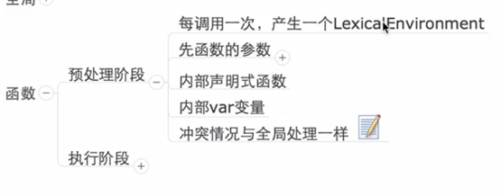

### 预处理阶段
**函数的词法环境无法访问**

1.处理函数声明有冲突会覆盖

2.处理变量声明时有冲突会忽略

    alert(f)
    function f(){
        console.log(111)
        }
    var f = 2
    function f(){
    console.log(222)
    }
//输出结果是222

### 执行阶段
不用var声明的变量会变成最外部词法环境的变量

